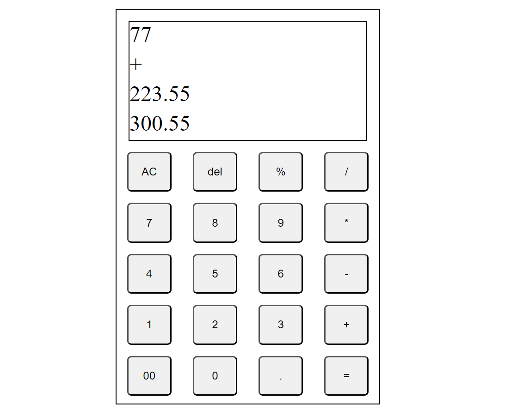

# Calci
This web calculator features the normal and some basic levels of complex arithmetic operations.
technology stack implemented is html, css, and javascript.

``` javascript
console.log("Arithmetic Operation Featuring Calci");
```
