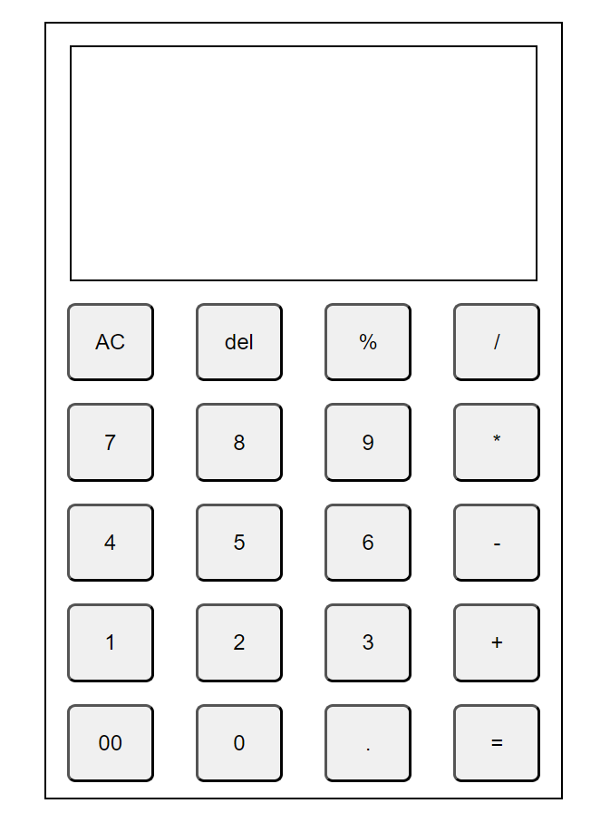

# Calci
This is a web calculator featuring the normal and some basic level of complex arithmetic operations.
technology stack implimented is html, css and javascript.
``` javascript
console.log("Arithmetic Operation Featuring Calci");
```
